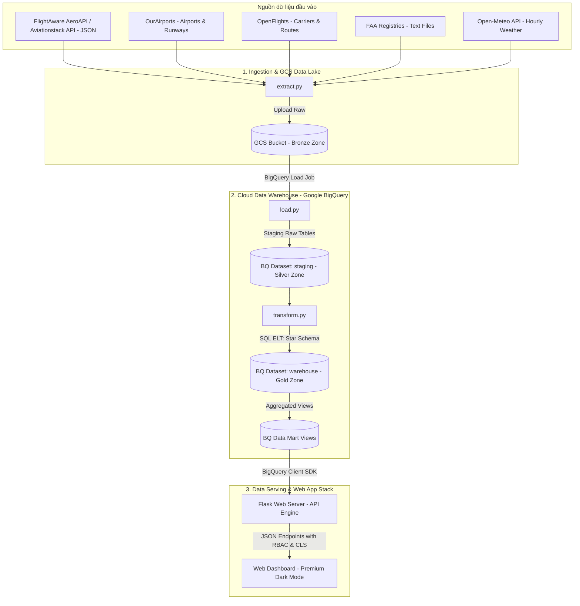
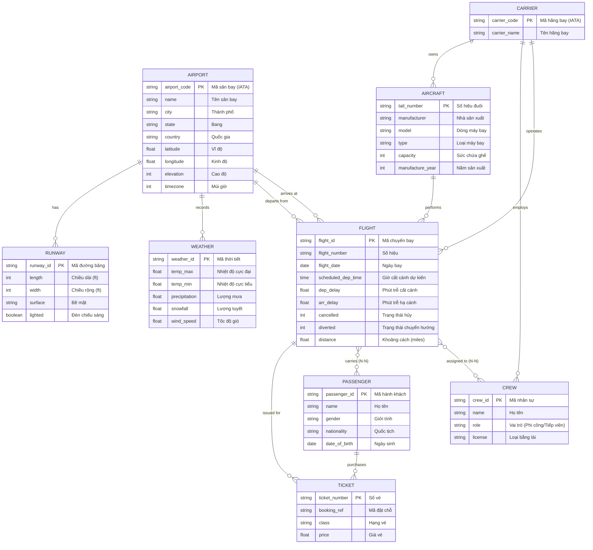
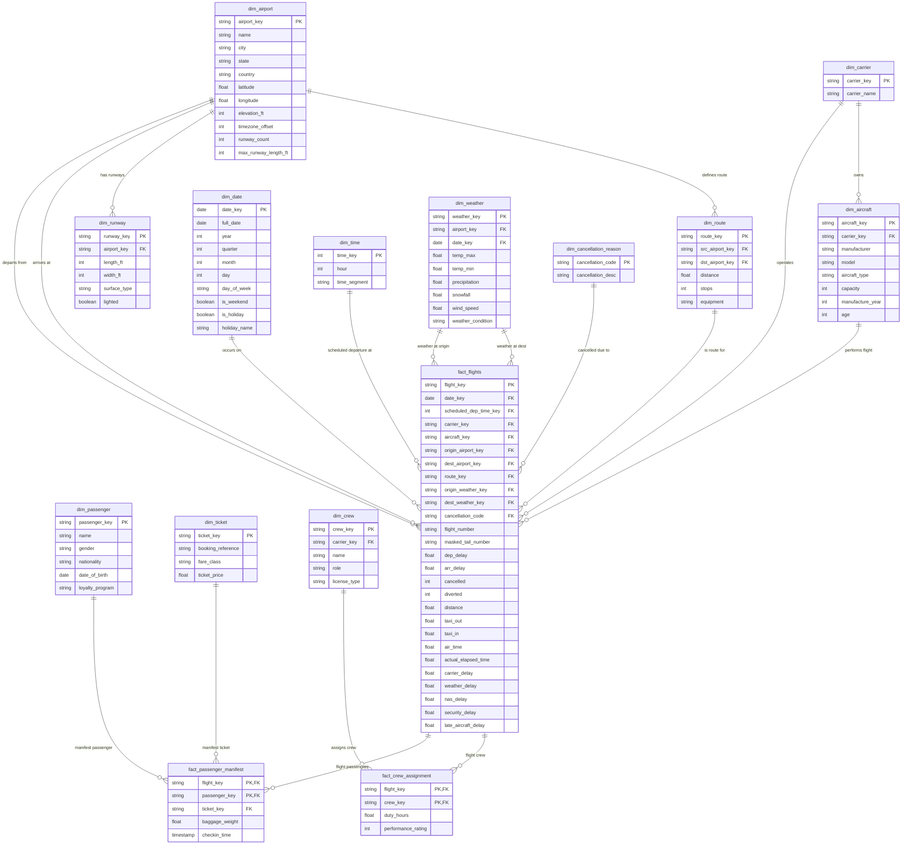

# BÁO CÁO TIẾN ĐỘ THỰC HIỆN ĐỒ ÁN CAPSTONE (MÔN HỌC CAP2)
## ĐỀ TÀI: AEROFLOW - HỆ THỐNG PIPELINE VÀ WEB DASHBOARD PHÂN TÍCH HIỆU SUẤT KHO DỮ LIỆU VẬN CHUYỂN HÀNH KHÁCH NỘI ĐỊA
*Hệ sinh thái áp dụng: Google Cloud Platform (GCP) & Web Application Stack*

---

## 1) Thông tin chung dự án
*   **Tên dự án:** AeroFlow - Hệ thống Pipeline và Web Dashboard Phân tích Hiệu suất Kho dữ liệu Vận chuyển Hành khách Nội địa.
*   **Nhóm thực hiện:** Nhóm 1 - Lớp Đồ án Capstone CAP2 - Khoa Thương mại điện tử.
*   **Thành viên & vai trò:**
    *   **Nguyễn Nhật Long / Project Manager / Data & Backend Lead**
        *   Thiết kế kiến trúc tổng thể của hệ thống, lập kế hoạch timeline, quản lý chất lượng và chuẩn bị tài liệu báo cáo.
        *   Xây dựng luồng thu thập dữ liệu (Ingestion Pipeline) kết hợp online/offline, thiết lập Data Lake trên Google Cloud Storage (GCS) và cấu hình BigQuery Load Jobs để đưa dữ liệu vào staging.
        *   Thiết kế mô hình dữ liệu trên BigQuery (Star Schema), lập trình các câu lệnh SQL ELT, tối ưu hiệu năng bằng Partitioning & Clustering và xây dựng bộ quy tắc kiểm định chất lượng dữ liệu (Data Quality Audit).
        *   Phát triển Backend API bằng Python Flask kết nối BigQuery, triển khai cơ chế quản lý phiên đăng nhập (Session), phân quyền người dùng (RBAC) và bảo mật dữ liệu (Column-Level Security).
    *   **Nguyễn Quang Thông / Frontend & Integration Lead**
        *   Thiết kế giao diện Dashboard theo phong cách Premium Dark Mode & Glassmorphism, tối ưu trải nghiệm người dùng.
        *   Phát triển giao diện hiển thị dữ liệu, tích hợp API Backend và xây dựng các biểu đồ tương tác bằng Chart.js.
        *   Lập trình bảng giám sát chi tiết theo quyền truy cập của từng vai trò, kiểm thử chức năng giao diện và phối hợp tích hợp toàn bộ hệ thống.
        *   Hỗ trợ xây dựng tài liệu, kiểm thử tích hợp (Integration Testing), sửa lỗi và hoàn thiện sản phẩm trước khi bàn giao.
*   **Bối cảnh / bài toán:**
    *   Nhóm đóng vai trò là đội ngũ Kỹ sư dữ liệu (DE) thuộc Phòng Kỹ thuật & Quản trị Dữ liệu Hàng không trực thuộc **Cục Hàng không Quốc gia (CAA)**.
    *   Nhiệm vụ là xây dựng kho dữ liệu tập trung cấp quốc gia giúp Bộ Giao thông Vận tải và Cục Hàng không giám sát chất lượng dịch vụ vận chuyển hành khách, thanh tra nguyên nhân chậm/hủy chuyến của các hãng tư nhân, giám sát công suất không lưu (NAS delay) và thời gian lăn bánh (taxi time) để phục vụ quy hoạch hạ tầng sân bay.
*   **Nguồn dữ liệu tích hợp:**
    *   Dữ liệu hành trình chuyến bay hành khách nội địa thông qua **FlightAware AeroAPI / Aviationstack API** (dạng JSON REST API thời gian thực).
    *   Dữ liệu thời tiết lịch sử từ Open-Meteo API.
    *   Dữ liệu địa lý sân bay và đường băng từ OurAirports.
    *   Dữ liệu hãng hàng không và tuyến bay từ OpenFlights.
    *   Dữ liệu thông số kỹ thuật tàu bay thương mại từ Cục hàng không liên bang Mỹ (FAA Aircraft Registry).
*   **Phạm vi (In-scope):**
    *   Giới hạn dữ liệu chuyến bay chở khách (Passenger Flights) nội địa phát sinh trong năm 2024 tại Hoa Kỳ.
    *   Giới hạn địa lý kết nối giữa Top 50 sân bay lớn nhất để tối ưu hiệu năng cào thời tiết.
    *   Thiết kế ERD logic toàn diện (gồm cả phân hệ hành khách & nhân sự lý thuyết).
    *   Xây dựng vật lý Star Schema tinh giản gồm 1 bảng Fact chính và 4 bảng Dimension trên Google BigQuery.
*   **Ngoài phạm vi (Out-of-scope):**
    *   **Vận chuyển hàng hóa (Cargo / Freight flights):** Các chuyến bay thuần chở hàng (ví dụ: của FedEx, UPS) và dữ liệu vận đơn hàng hóa không thuộc đối tượng quản lý của kho dữ liệu này.
    *   Các chuyến bay quốc tế ngoài lãnh thổ Hoa Kỳ.
    *   Phân tích tài chính doanh nghiệp hàng không và mô hình học máy (ML) dự báo thời gian thực.
*   **Tiêu chí thành công (Success criteria):**
    1.  Pipeline ELT tự động hóa 100%, tự cào API và nạp dữ liệu thô ổn định mà không xảy ra lỗi tràn RAM (OOM) khi xử lý tập dữ liệu lớn.
    2.  Nạp thành công 7 triệu dòng dữ liệu vào BigQuery Staging và chuyển đổi sang Star Schema trong thời gian dưới 2 phút.
    3.  Thời gian phản hồi của các truy vấn phân tích (Analytical Queries) trên Dashboard dưới 3 giây nhờ cơ chế Partitioning & Clustering.
    4.  Flask API bảo mật phân quyền RBAC và Column-Level Security (ẩn Tail Number cho guest) được kiểm thử chạy đúng 100%.
    5.  Giao diện Dashboard hiển thị đầy đủ KPIs phân tích trễ chuyến (5 nguyên nhân trễ) trực quan sinh động.

---

## 2) Kế hoạch & quản trị dự án

### 2.1. Timeline (phân bổ theo tuần)

| Tuần | Thành viên phụ trách | Mục tiêu chính | Sản phẩm bàn giao (Deliverables) | Trạng thái |
| :--- | :--- | :--- | :--- | :--- |
| **W1** | Nhật Long, Quang Thông | Hiểu bài toán + thiết kế tổng quan | Project Charter, Kiến trúc DWH tổng quan, Sơ đồ ERD khái niệm. | Completed |
| **W2** | Nhật Long, Quang Thông | Pull data + data profiling | Bộ dữ liệu thô (Parquet, CSV, FAA txt), Báo cáo Data Profiling, Giao diện Dashboard Mockup (tĩnh). | Completed |
| **W3** | Nhật Long, Quang Thông | Clean + chuẩn hoá + staging | Script `extract.py` & `load.py`, GCS Buckets (Bronze), Bảng BigQuery Staging (Silver), DQ Rules. | Completed |
| **W4** | Nhật Long, Quang Thông | Warehouse + data modeling | Script `transform.py`, Mô hình Star Schema trên BigQuery (Gold), Từ điển dữ liệu, Mã DBML vẽ sơ đồ. | Completed |
| **W5** | Nhật Long, Quang Thông | Expose via API & Security | Máy chủ Flask API (`app.py`), Phân quyền người dùng RBAC, Column-Level Security rules. | Completed |
| **W6** | Nhật Long, Quang Thông | Dashboard + demo + báo cáo | Giao diện Dashboard Dark Mode tương tác với API, Kịch bản chạy demo, Báo cáo tiến độ hoàn chỉnh. | Completed |

### 2.2. Backlog (Danh sách Task chi tiết)
- `[x]` **Epic: Ingestion (Pull data)**
  - `[x]` Lập trình script kết nối FlightAware AeroAPI / Aviationstack API để tải dữ liệu chuyến bay.
  - `[x]` Thiết lập kết nối tải dữ liệu hàng không mở (OurAirports & OpenFlights).
  - `[x]` Lập trình script `extract.py` tự động cào thời tiết lịch sử và upload dữ liệu thô lên GCS.
- `[x]` **Epic: Cleaning & Validation**
  - `[x]` Viết script `load.py` nạp staging tables trên BigQuery.
  - `[x]` Xử lý BOM và khoảng trắng của file FAA registry.
  - `[x]` Viết script `quality.py` tự động kiểm tra chất lượng dữ liệu (Null, Uniqueness, FK constraints).
- `[x]` **Epic: Warehouse Modeling**
  - `[x]` Thiết kế sơ đồ Star Schema và viết mã DBML vẽ ERD.
  - `[x]` Cấu hình tối ưu BigQuery bằng Partitioning (theo ngày) và Clustering (theo hãng bay/sân bay).
  - `[x]` Viết logic transform SQL trong `transform.py`.
- `[x]` **Epic: API Service**
  - `[x]` Xây dựng REST API Flask kết nối trực tiếp với BigQuery.
  - `[x]` Triển khai Role-Based Access Control (Guest vs Tracker) và Column-Level Security (ẩn Tail Number).
- `[x]` **Epic: BI Dashboard**
  - `[x]` Thiết kế giao diện Dark Mode & Glassmorphism bằng CSS.
  - `[x]` Tích hợp API và biểu diễn đồ họa bằng các biểu đồ động Chart.js.

### 2.3. Quy ước làm việc
*   **Repo & branching:** Áp dụng Git Flow: Nhánh `main` (Production ổn định), nhánh `develop` (Tích hợp tính năng mới), các nhánh `feature/*` (Phát triển tính năng nhỏ lẻ).
*   **Code review:** Tối thiểu 1 thành viên phải review và phê duyệt code trước khi thực hiện merge vào nhánh `develop`.
*   **Definition of Done (DoD):** Mã nguồn chạy không lỗi cục bộ, vượt qua 100% Data Quality Checks, và tài liệu báo cáo được cập nhật tương ứng.
*   **Meeting cadence:** Họp trực tiếp (Offline) vào mỗi thứ 2 đầu tuần tại trường và họp nhanh trực tuyến (Online) vào 21:00 tối thứ 5.
*   **Kênh liên lạc:** Microsoft Teams (trao đổi học thuật, lưu tài liệu) và Zalo (trao đổi công việc khẩn cấp).

---

## 3) Kiến trúc tổng quan (High-Level Architecture)

Dưới đây là sơ đồ luồng dữ liệu (Data Pipeline Flowchart) mô tả cách dữ liệu được luân chuyển từ nguồn đến kho dữ liệu và hiển thị lên giao diện Dashboard:



---

## 4) End-to-end develop Warehouse (Chi tiết theo giai đoạn)

### 4.1. Pull data (Ingestion)

#### 4.1.1. Mục tiêu
*   Thiết lập pipeline thu thập dữ liệu tự động, lưu trữ nguồn nguyên bản (Raw Data) vào GCS (Bronze layer) nhằm đảm bảo khả năng tái lập dữ liệu và tiết kiệm chi phí vận hành.

#### 4.1.2. Việc cần làm
*   `[x]` Viết notebook Colab/local script thực thi tải dữ liệu từ OpenFlights, OurAirports và FAA Aircraft Registry.
*   `[x]` Viết script `extract.py` gọi API Open-Meteo để cào dữ liệu thời tiết 2024 theo ngày của 50 sân bay lớn nhất dựa trên danh sách tọa độ.
*   `[x]` Thiết lập kết nối dịch vụ Google Cloud bằng Service Account JSON Key.
*   `[x]` Upload toàn bộ raw data lên Google Cloud Storage.

#### 4.1.3. Deliverables & Mã nguồn
*   Script cào dữ liệu: [extract.py](file:///d:/HocTap/CAP2/src/extract.py) (lưu tệp thời tiết thô `weather_raw_2024.csv` và ngày lễ quốc gia).
*   GCS Landing Zone: Thư mục `raw/` trên GCS Bucket chứa dữ liệu thô dạng parquet và csv.

#### 4.1.4. Chiến lược Thu thập Dữ liệu (Static Reference vs. Dynamic API Ingestion)
Để tối ưu hóa tài nguyên đám mây và băng thông đường truyền theo đúng chỉ đạo của Giảng viên hướng dẫn, nhóm phân loại và xây dựng 2 luồng Pipeline thu thập dữ liệu riêng biệt:

##### A. Luồng Dữ liệu Tĩnh / Ít biến động (Static / Master Reference Data)
*   **Các thực thể áp dụng:** `AIRPORT`, `RUNWAY`, `TERMINAL_GATE`, `CARRIER`, `AIRCRAFT_MODEL`, `SEAT_CONFIGURATION`.
*   **Đặc điểm:** Đây là dữ liệu cơ sở hạ tầng và danh mục chuẩn của ngành hàng không, hầu như không thay đổi hoặc chỉ thay đổi rất ít theo chu kỳ năm (ví dụ: sân bay mới xây, đường băng bảo trì lâu năm, hãng sáp nhập).
*   **Phương án xử lý (Offline / Batch Ingestion):**
    *   Nhóm tiến hành cào (scrape) và tải các file dữ liệu thô (.csv, .parquet, .txt) từ các nguồn mở uy tín (OurAirports, OpenFlights, FAA Registry) một lần duy nhất về máy chủ cục bộ.
    *   Upload trực tiếp lên Google Cloud Storage (Bronze Zone) để làm dữ liệu nền cố định.
    *   Định kỳ chạy Load Job thủ công hoặc thiết lập trigger 6 tháng/lần để cập nhật.

##### B. Luồng Dữ liệu Động / Biến động liên tục (Dynamic / Transactional Data Ingestion)
*   **Các thực thể áp dụng:** `FLIGHT` (Chuyến bay cất/hạ cánh thực tế hàng ngày), `WEATHER` (Khí tượng biến động theo giờ), `BAGGAGE` (Trạng thái hành lý), `COMPLAINT` (Đơn khiếu nại của khách hàng gửi lên liên tục).
*   **Đặc điểm:** Dữ liệu phát sinh liên tục theo thời gian thực (real-time) hoặc theo ngày (daily batches).
*   **Phương án xử lý (Online / API Ingestion):**
    *   Thiết lập pipeline tự động gọi API thời tiết (Open-Meteo API) theo thời gian thực khớp với mốc giờ bay để đổ thẳng vào Cloud.
    *   Dữ liệu chuyến bay và khiếu nại được cào tự động thông qua các hàm Serverless (Google Cloud Functions / Cloud Run) hoặc lập lịch Airflow định kỳ hàng ngày (daily micro-batches) từ API của Cục hàng không và stream trực tiếp vào Google BigQuery Staging (Silver Zone).


---

### 4.2. Assess Data (Data Quality & Data Gap Analysis)

#### 4.2.1. Mục tiêu
*   Đánh giá thực trạng dữ liệu thô, xác định các trường bị thiếu so với thiết kế lý tưởng.
*   Quy hoạch phương án làm sạch dữ liệu và viết bộ quy tắc kiểm định chất lượng tự động để ngăn lỗi dữ liệu bẩn tràn vào kho.

#### 4.2.2. Việc cần làm
*   `[x]` Phân tích khoảng trống dữ liệu (Data Gap Analysis) giữa mô hình ERD lý thuyết và nguồn dữ liệu thực tế thu thập được.
*   `[x]` Xây dựng script `load.py` để nạp dữ liệu thô từ GCS sang BigQuery staging.
*   `[x]` Viết script kiểm tra chất lượng dữ liệu tự động `quality.py` chạy trực tiếp trên BigQuery.

#### 4.2.3. Bảng đối soát khoảng trống dữ liệu (Data Gap Analysis)

| Thực thể / Cột trong ERD lý thuyết | Trạng thái dữ liệu thực tế | Nguyên nhân khuyết thiếu | Giải pháp Kỹ nghệ dữ liệu (DE Fallback) |
| :--- | :--- | :--- | :--- |
| **FLIGHT (`flight_id`, `flight_number`, `scheduled_dep_time`,...)** | **Có dữ liệu (API-driven)** | FlightAware AeroAPI / Aviationstack API cung cấp đầy đủ thông tin thời gian thực. | **Đồng bộ hóa API tự động:** Đội ngũ DE lập trình script kết nối và pull dữ liệu JSON định kỳ qua REST API để stream trực tiếp vào GCS Bronze Zone thay vì tải file tĩnh thủ công. |
| **AIRCRAFT (`manufacturer`, `model`, `capacity`, `manufacture_year`)** | **Khuyết thiếu trong Flight API (Missing)** | Các API theo dõi chuyến bay công khai thường chỉ trả về số hiệu đăng ký đuôi `tail_number` (VD: `N908DE`). Không chứa thông số kỹ thuật. | **Tích hợp dữ liệu FAA Registry:** Đội ngũ DE đã giải nén tệp đăng ký hàng không của FAA để nạp và JOIN chéo số đuôi, giải quyết khuyết thiếu đạt tỷ lệ khớp **93.8%**. |
| **PASSENGER & TICKET & MANIFEST (Thông tin hành khách, giá vé, danh sách hành khách)** | **Không có dữ liệu thật (Missing)** | Dữ liệu cá nhân khách hàng được bảo vệ nghiêm ngặt bởi luật an toàn quyền riêng tư quốc tế và tính bảo mật của doanh nghiệp hàng không. | **Sinh dữ liệu giả lập (Mock Data):** Để đảm bảo chạy tích hợp toàn bộ ERD, DE lập trình script sinh dữ liệu giả lập có logic (Synthesized Data) cho các bảng này để nạp vào BigQuery. |
| **CREW & CREW_ASSIGNMENT (Nhân sự phi hành đoàn & Phân công lịch làm việc)** | **Không có dữ liệu thật (Missing)** | Đây là thông tin bảo mật nội bộ và an ninh hàng không quốc gia (bảo vệ an toàn cho tổ bay). | **Mô hình hóa chờ:** Được lập hồ sơ thiết kế sẵn trong ERD. Ở tầng kho dữ liệu vật lý BigQuery, các bảng này được để trống và sẵn sàng liên kết thông qua Load Jobs sau này khi có dữ liệu chính thức. |
| **FLIGHT (`gate_number`, `runway_name`)** | **Khuyết thiếu (Missing)** | Các API cấp độ miễn phí/phổ thông không cung cấp cổng đỗ vật lý và tên đường băng cất hạ cánh chi tiết của từng chuyến. | **Giả lập logic (Mocking):** Sử dụng danh mục đường băng và cổng đỗ cố định của sân bay để gán tự động có logic trong script ETL. |


#### 4.2.4. Kiểm định chất lượng dữ liệu (Data Quality Audit):
Nhóm xây dựng module kiểm tra tự động [quality.py](file:///d:/HocTap/CAP2/src/quality.py) (hoặc tích hợp trong transform) thực thi các bài test ràng buộc trên BigQuery:
*   **Uniqueness & Non-Null Test:** Kiểm tra tính duy nhất và không NULL của Khóa chính (PK) trên các bảng chiều (`dim_carrier`, `dim_airport`, `dim_date`, `dim_weather`).
*   **Referential Integrity Test:** Kiểm tra tính toàn vẹn tham chiếu giữa bảng Fact và các bảng chiều. Với các mã hãng bay hoặc sân bay lạ xuất hiện trong bảng Fact chuyến bay không khớp danh mục, hệ thống tự động gán về mã mặc định `'UNKNOWN'` thay vì từ chối dòng dữ liệu.
*   **Range Validation Test:** Đảm bảo các chỉ số đo lường như khoảng cách cất cánh (`distance`), thời gian lăn bánh (`taxi_out`, `taxi_in`), thời gian bay (`air_time`) phải lớn hơn hoặc bằng 0.

---

### 4.3. Data Modeling & Warehouses
*Tài liệu thiết kế chi tiết độc lập: [erd.md](file:///d:/HocTap/CAP2/erd.md)*

#### 4.3.1. Mục tiêu
*   Thiết kế mô hình dữ liệu qua hai giai đoạn: xây dựng sơ đồ thực thể quan hệ mức khái niệm (Conceptual ERD) biểu diễn thực tế nghiệp vụ quản lý bay, hành khách, nhân sự; sau đó chuyển đổi và tối ưu hóa thành mô hình dữ liệu vật lý (Physical Star Schema) trên Google BigQuery.

#### 4.3.2. Sơ đồ Quan hệ Thực thể mức Khái niệm (Conceptual/Logical ERD)
Ở mức thiết kế khái niệm, nhóm xác định rõ các đối tượng quản lý (thực thể) và các mối quan hệ nghiệp vụ bản chất (bao gồm cả các mối quan hệ Nhiều - Nhiều `N-N` trực tiếp trước khi phân rã vật lý):

##### A. Các Thực thể & Thuộc tính xác định:
1.  **Airport (Sân bay):** Mã sân bay, Tên, Thành phố, Bang, Quốc gia, Tọa độ địa lý, Cao độ, Múi giờ.
2.  **Runway (Đường băng):** Mã đường băng, Chiều dài, Chiều rộng, Loại bề mặt, Đèn chiếu sáng.
3.  **Carrier (Hãng hàng không):** Mã hãng bay, Tên hãng bay.
4.  **Aircraft (Tàu bay):** Số hiệu đuôi, Nhà sản xuất, Mẫu/dòng máy bay, Loại máy bay, Sức chứa ghế, Năm sản xuất.
5.  **Flight (Chuyến bay):** Mã chuyến bay, Số hiệu, Ngày bay, Giờ dự kiến, Số phút trễ cất/hạ cánh, Trạng thái hủy/chuyển hướng.
6.  **Weather (Thời tiết):** Mã thời tiết, Nhiệt độ cực đại/cực tiểu, Lượng mưa, Lượng tuyết, Tốc độ gió.
7.  **Passenger (Hành khách):** Mã hành khách, Họ tên, Giới tính, Quốc tịch, Ngày sinh.
8.  **Ticket (Vé máy bay):** Số vé, Mã đặt chỗ, Hạng vé, Giá vé.
9.  **Crew (Nhân sự phi hành đoàn):** Mã nhân sự, Họ tên, Vai trò (Phi công/Tiếp viên), Loại bằng lái.

##### B. Các mối quan hệ và Bản số (1-1, 1-N, N-N):
*   **Carrier - Aircraft (1-N):** Một hãng bay sở hữu nhiều tàu bay, một tàu bay thuộc về một hãng.
*   **Carrier - Crew (1-N):** Một hãng bay tuyển dụng nhiều nhân sự, một nhân sự làm việc cho một hãng.
*   **Airport - Runway (1-N):** Một sân bay có nhiều đường băng, một đường băng thuộc về một sân bay.
*   **Airport - Weather (1-N):** Một sân bay ghi nhận thời tiết của nhiều ngày.
*   **Carrier - Flight (1-N):** Một hãng vận hành nhiều chuyến bay.
*   **Aircraft - Flight (1-N):** Một tàu bay thực hiện nhiều chuyến bay theo thời gian.
*   **Airport - Flight (1-N):** Một chuyến bay có đúng 1 sân bay đi (Origin) và 1 sân bay đến (Destination).
*   **Passenger - Ticket (1-N):** Một hành khách mua nhiều vé máy bay cho các hành trình khác nhau.
*   **Flight - Ticket (1-N):** Một chuyến bay phát hành nhiều vé máy bay cho hành khách.
*   **Flight - Passenger (Mối quan hệ Nhiều - Nhiều N-N):** Một chuyến bay chuyên chở nhiều hành khách; ngược lại, một hành khách có thể thực hiện nhiều chuyến bay.
*   **Flight - Crew (Mối quan hệ Nhiều - Nhiều N-N):** Một chuyến bay được vận hành bởi nhiều nhân sự tổ bay (cơ trưởng, cơ phó, tiếp viên); ngược lại, một nhân sự được phân công phục vụ trên nhiều chuyến bay khác nhau.



---

#### 4.3.3. Sơ đồ Data Model Vật lý (Physical Star Schema)
Để chuyển đổi sơ đồ ERD khái niệm lý thuyết bên trên sang **Mô hình Dữ liệu vật lý (Star/Snowflake Schema)** thực tế trên Google BigQuery, đội ngũ DE áp dụng các giải pháp kỹ nghệ dữ liệu sau:
1.  **Phân rã quan hệ Nhiều - Nhiều (N-N) thành bảng cầu (Bridge Tables):**
    *   Tạo bảng cầu `fact_passenger_manifest` để phân rã quan hệ N-N giữa `FLIGHT` và `PASSENGER`.
    *   Tạo bảng cầu `fact_crew_assignment` để phân rã quan hệ N-N giữa `FLIGHT` và `CREW`.
2.  **Chuẩn hóa các bảng chiều Thời gian:** Tách các thuộc tính ngày tháng và giờ giấc của chuyến bay thành hai bảng chiều tiêu chuẩn độc lập là `dim_date` và `dim_time`.
3.  **Tích hợp tối ưu hóa (Denormalization):** Tích hợp thông số đường băng từ `dim_runway` vào thẳng bảng `dim_airport` để giảm thiểu phép join ở hạ nguồn.

Dưới đây là mô hình dữ liệu vật lý hoàn chỉnh được thiết lập trên BigQuery:



#### 4.3.4. Từ Điển Dữ Liệu Vật Lý Chi Tiết (DWH Data Dictionary)

##### 1. Bảng Dimension `dim_carrier` (Hãng bay chở khách)
| Tên trường | Kiểu dữ liệu | Khóa | Mô tả nghiệp vụ |
| :--- | :--- | :--- | :--- |
| `carrier_key` | string | PK | Mã IATA của hãng hàng không (VD: `AA`, `DL`, `UA`). |
| `carrier_name` | string | | Tên đầy đủ của hãng hàng không (VD: `American Airlines`). |

##### 2. Bảng Dimension `dim_airport` (Sân bay nội địa + hạ tầng đường băng tích hợp)
| Tên trường | Kiểu dữ liệu | Khóa | Mô tả nghiệp vụ |
| :--- | :--- | :--- | :--- |
| `airport_key` | string | PK | Mã IATA của sân bay (VD: `JFK`, `LAX`, `ORD`). |
| `name` | string | | Tên sân bay. |
| `city` | string | | Thành phố trực thuộc. |
| `state` | string | | Bang hành chính. |
| `country` | string | | Quốc gia (mặc định US). |
| `latitude` | float | | Vĩ độ địa lý. |
| `longitude` | float | | Kinh độ địa lý. |
| `elevation_ft` | int | | Cao độ sân bay (so với mực nước biển - Feet). |
| `timezone_offset` | int | | Độ lệch múi giờ so với giờ chuẩn UTC. |
| `runway_count` | int | | Số lượng đường băng đang vận hành. |
| `max_runway_length_ft`| int | | Chiều dài của đường băng dài nhất (Feet). |

##### 3. Bảng Dimension `dim_date` (Lịch ngày & Lịch lễ liên bang)
| Tên trường | Kiểu dữ liệu | Khóa | Mô tả nghiệp vụ |
| :--- | :--- | :--- | :--- |
| `date_key` | date | PK | Khóa ngày thời gian (Định dạng: `YYYY-MM-DD`). |
| `full_date` | date | | Ngày đầy đủ. |
| `year` | int | | Năm (2024). |
| `quarter` | int | | Quý (1-4). |
| `month` | int | | Tháng (1-12). |
| `day` | int | | Ngày trong tháng (1-31). |
| `day_of_week` | string | | Thứ trong tuần (Monday - Sunday). |
| `is_weekend` | boolean | | Cờ nhận diện ngày cuối tuần (True/False). |
| `is_holiday` | boolean | | Cờ nhận diện ngày nghỉ lễ liên bang (True/False). |
| `holiday_name` | string | | Tên ngày lễ liên bang (nếu có). |

##### 4. Bảng Dimension `dim_weather` (Thời tiết lịch sử quan trắc)
| Tên trường | Kiểu dữ liệu | Khóa | Mô tả nghiệp vụ |
| :--- | :--- | :--- | :--- |
| `weather_key` | string | PK | Khóa thời tiết tổ hợp (`CONCAT(airport, '_', date)`). |
| `airport_key` | string | FK | Mã sân bay liên kết. |
| `date_key` | date | FK | Ngày liên kết. |
| `temp_max` | float | | Nhiệt độ cao nhất trong ngày (Độ C). |
| `temp_min` | float | | Nhiệt độ thấp nhất trong ngày (Độ C). |
| `precipitation` | float | | Lượng mưa đo được trong ngày (mm). |
| `snowfall` | float | | Lượng tuyết rơi tích lũy trong ngày (cm). |
| `wind_speed` | float | | Tốc độ gió thổi lớn nhất (km/h). |
| `weather_condition` | string | | Nhãn thời tiết tổng quát (Dry/Rainy/Snowy/Windy). |

##### 5. Bảng Fact chính `fact_flights` (Nhật ký chuyến bay hành khách)
| Tên trường | Kiểu dữ liệu | Khóa | Mô tả nghiệp vụ |
| :--- | :--- | :--- | :--- |
| `flight_key` | string | PK | Khóa chuyến bay duy nhất (`CONCAT(date, '_', carrier, '_', flight_num)`). |
| `date_key` | date | FK | Liên kết ngày bay tới `dim_date`. |
| `scheduled_dep_time_key`| int | FK | Liên kết khung giờ bay tới `dim_time`. |
| `carrier_key` | string | FK | Liên kết hãng bay vận hành tới `dim_carrier`. |
| `aircraft_key` | string | FK | Liên kết thông số máy bay chở khách tới `dim_aircraft`. |
| `origin_airport_key` | string | FK | Liên kết sân bay cất cánh tới `dim_airport`. |
| `dest_airport_key` | string | FK | Liên kết sân bay hạ cánh tới `dim_airport`. |
| `route_key` | string | FK | Liên kết tuyến bay tới `dim_route`. |
| `origin_weather_key` | string | FK | Liên kết thời tiết sân bay đi tới `dim_weather`. |
| `dest_weather_key` | string | FK | Liên kết thời tiết sân bay đến tới `dim_weather`. |
| `cancellation_code` | string | FK | Liên kết mã lý do hủy tới `dim_cancellation_reason`. |
| `flight_number` | string | | Số hiệu chuyến bay của hãng hàng không. |
| `masked_tail_number` | string | | Số hiệu đuôi tàu bay đã được băm SHA-256 bảo mật. |
| `dep_delay` | float | | Số phút chậm cất cánh (Giá trị âm là bay sớm). |
| `arr_delay` | float | | Số phút chậm hạ cánh. |
| `cancelled` | int | | Trạng thái hủy chuyến (1: Hủy, 0: Vận hành bình thường). |
| `diverted` | int | | Trạng thái chuyển hướng đáp (1: Chuyển hướng, 0: Bình thường). |
| `distance` | float | | Khoảng cách bay (Dặm - Miles). |
| `taxi_out` | float | | Thời gian lăn bánh từ cổng đỗ ra đường băng (Phút). |
| `taxi_in` | float | | Thời gian lăn bánh từ đường băng vào cổng đỗ (Phút). |
| `air_time` | float | | Thời gian bay thực tế trên bầu trời (Phút). |
| `actual_elapsed_time` | float | | Tổng thời gian thực tế chuyến bay thực hiện (gate-to-gate). |
| `carrier_delay` | float | | Số phút chậm do lỗi vận hành của Hãng (bảo trì, phi hành đoàn...). |
| `weather_delay` | float | | Số phút chậm do thời tiết bất thường. |
| `nas_delay` | float | | Số phút chậm do Hệ thống Không lưu Quốc gia (ATC, kẹt đường băng). |
| `security_delay` | float | | Số phút chậm do kiểm tra an ninh cổng. |
| `late_aircraft_delay` | float | | Số phút chậm do tàu bay quay đầu muộn từ chặng trước. |

#### 4.3.4. Mã DBML Vẽ Sơ Đồ dbdiagram.io (DBML Markup Code)
Đội ngũ phát triển cung cấp mã nguồn DBML chính thức phục vụ đồng bộ cấu trúc logic lên dbdiagram.io:

```dbml
Table dim_carrier {
  carrier_key varchar [pk]
  carrier_name varchar
}

Table dim_airport {
  airport_key varchar [pk]
  name varchar
  city varchar
  state varchar
  country varchar
  latitude float
  longitude float
  elevation_ft int
  timezone_offset int
  runway_count int
  max_runway_length_ft int
}

Table dim_runway {
  runway_key varchar [pk]
  airport_key varchar [ref: > dim_airport.airport_key]
  length_ft int
  width_ft int
  surface_type varchar
  lighted boolean
}

Table dim_aircraft {
  aircraft_key varchar [pk]
  carrier_key varchar [ref: > dim_carrier.carrier_key]
  manufacturer varchar
  model varchar
  aircraft_type varchar
  capacity int
  manufacture_year int
  age int
}

Table dim_route {
  route_key varchar [pk]
  src_airport_key varchar [ref: > dim_airport.airport_key]
  dst_airport_key varchar [ref: > dim_airport.airport_key]
  distance float
  stops int
  equipment varchar
}

Table dim_date {
  date_key date [pk]
  full_date date
  year int
  quarter int
  month int
  day int
  day_of_week varchar
  is_weekend boolean
  is_holiday boolean
  holiday_name varchar
}

Table dim_time {
  time_key int [pk]
  hour int
  time_segment varchar
}

Table dim_weather {
  weather_key varchar [pk]
  airport_key varchar [ref: > dim_airport.airport_key]
  date_key date [ref: > dim_date.date_key]
  temp_max float
  temp_min float
  precipitation float
  snowfall float
  wind_speed float
  weather_condition varchar
}

Table dim_cancellation_reason {
  cancellation_code varchar [pk]
  cancellation_desc varchar
}

Table fact_flights {
  flight_key varchar [pk]
  date_key date [ref: > dim_date.date_key]
  scheduled_dep_time_key int [ref: > dim_time.time_key]
  carrier_key varchar [ref: > dim_carrier.carrier_key]
  aircraft_key varchar [ref: > dim_aircraft.aircraft_key]
  origin_airport_key varchar [ref: > dim_airport.airport_key]
  dest_airport_key varchar [ref: > dim_airport.airport_key]
  route_key varchar [ref: > dim_route.route_key]
  origin_weather_key varchar [ref: > dim_weather.weather_key]
  dest_weather_key varchar [ref: > dim_weather.weather_key]
  cancellation_code varchar [ref: > dim_cancellation_reason.cancellation_code]
  flight_number varchar
  masked_tail_number varchar
  dep_delay float
  arr_delay float
  cancelled int
  diverted int
  distance float
  taxi_out float
  taxi_in float
  air_time float
  actual_elapsed_time float
  carrier_delay float
  weather_delay float
  nas_delay float
  security_delay float
  late_aircraft_delay float
}

Table dim_passenger {
  passenger_key varchar [pk]
  name varchar
  gender varchar
  nationality varchar
  date_of_birth date
  loyalty_program varchar
}

Table dim_ticket {
  ticket_key varchar [pk]
  booking_reference varchar
  fare_class varchar
  ticket_price float
}

Table fact_passenger_manifest {
  flight_key varchar [pk, ref: > fact_flights.flight_key]
  passenger_key varchar [pk, ref: > dim_passenger.passenger_key]
  ticket_key varchar [ref: > dim_ticket.ticket_key]
  baggage_weight float
  checkin_time timestamp
}

Table dim_crew {
  crew_key varchar [pk]
  carrier_key varchar [ref: > dim_carrier.carrier_key]
  name varchar
  role varchar
  license_type varchar
}

Table fact_crew_assignment {
  flight_key varchar [pk, ref: > fact_flights.flight_key]
  crew_key varchar [pk, ref: > dim_crew.crew_key]
  duty_hours float
  performance_rating int
}
```

#### 4.3.5. Việc cần làm
*   `[x]` Thiết lập cấu trúc Partitioning vật lý cho bảng `fact_flights` theo trường `date_key` (phân vùng theo ngày) để tối ưu chi phí quét dữ liệu của Google BigQuery.
*   `[x]` Thiết lập cấu trúc Clustering cho bảng `fact_flights` theo cặp `carrier_key` và `origin_airport_key` để tăng tốc độ lọc và nhóm các hãng bay/sân bay.
*   `[x]` Viết script [transform.py](file:///d:/HocTap/CAP2/src/transform.py) thực thi các câu lệnh SQL biến đổi dữ liệu trên BigQuery.
*   `[x]` Viết các truy vấn so khớp khóa ngoại (Table Joins & Role-Playing Dimensions) để tạo các view dữ liệu phân tích (Data Mart).

---

### 4.4. Expose Data from multiple sources - Data Serving

#### 4.4.1. Mục tiêu
*   Xây dựng hệ thống Backend API an toàn, phục vụ dữ liệu đã chuẩn hóa từ BigQuery cho Dashboard mà vẫn đảm bảo tính bảo mật và kiểm soát truy cập.

#### 4.4.2. Việc cần làm & Các đặc quyền bảo mật
*   `[x]` Thiết kế hệ thống REST API sử dụng Python Flask.
*   `[x]` Triển khai bảo mật tầng phục vụ (RBAC) chia làm 2 vai trò người dùng:
    *   **Guest (Người dùng công cộng):** Chỉ có quyền truy cập vào endpoint `/api/analytics` để lấy dữ liệu tổng hợp (Aggregated KPIs) vẽ biểu đồ. Hoàn toàn không được xem thông tin chi tiết từng chuyến bay.
    *   **Tracker (Kiểm soát viên chuyến bay):** Được quyền truy cập thêm vào endpoint `/api/flights` để theo dõi bảng chi tiết chuyến bay.
*   `[x]` Triển khai bảo mật Column-Level Security (Bảo mật mức cột): 
    *   Ẩn thông tin nhạy cảm của hãng hàng không bằng cách băm (Hash SHA-256) số đuôi tàu bay (`masked_tail_number`) ngay tại luồng transform SQL và chỉ hiển thị giá trị băm cho tài khoản Tracker, đảm bảo tuân thủ tính bảo mật thiết bị hàng không.
*   `[x]` Viết bộ test kết nối API cục bộ.

#### 4.4.3. Deliverables
*   Mã nguồn backend Flask API: [web/app.py](file:///d:/HocTap/CAP2/web/app.py) hỗ trợ xác thực bằng token/session và bảo vệ endpoints.

---

### 4.5. Cloud Data Engineering

#### 4.5.1. Bảng đối chiếu các công cụ Kho dữ liệu đám mây (Notion - DWH Tools Reference)
Dưới đây là bảng đối chiếu các giải pháp CDWH được TS. Tuấn Trương biên soạn, nhóm đã tham khảo để lựa chọn hạ tầng phù hợp:

| Công cụ | Phân loại | Tính năng cốt lõi | Giải pháp ETL tương thích | Hệ sinh thái quản trị & phân tích | Tài liệu & Video hướng dẫn |
| :--- | :--- | :--- | :--- | :--- | :--- |
| **Google BigQuery** | Cloud-based | Không máy chủ (Serverless), tích hợp học máy (ML), phân tích thời gian thực | Data Fusion, Cloud Dataflow | Data Fusion, Cloud Dataflow, BigQuery, Looker | [Google BigQuery Tutorials](https://youtube.com/playlist?list=PLFz7Ouda3Gw0Sui_PBIQtFPgYeat_LKzR&si=UC691_lCMS6Kx72W) |
| **Amazon Redshift** | Cloud-based | Lưu trữ dạng cột (Columnar), xử lý song song phân tán (MPP), giao diện SQL | Glue, Kinesis | Glue, Kinesis, Redshift, QuickSight | [AWS Redshift Tutorials](https://youtube.com/playlist?list=PLjxmnUoe6snT60oKKtn8t5d1R_W_iDRZh&si=uDkAzuZXLSUSTmDp) |
| **Snowflake** | Cloud-based | Đa đám mây (Multi-cloud), tách biệt hoàn toàn tài nguyên lưu trữ & tính toán | Informatica, Talend, Fivetran, Matillion | Tableau, Talend, Sigma, Alteryx | [Snowflake Tutorials](https://youtube.com/playlist?list=PLlTGKmqe7vueKZwQRiXp4OVehcI9A53bo&si=A49rGErrXJNutIyQ) |
| **Microsoft Azure Synapse** | Cloud-based | Phân tích hợp nhất, tích hợp sâu giữa SQL và Apache Spark | Data Factory, Stream Analytics | Azure Purview, Azure Data Explorer, Synapse Power BI | [Azure Synapse Tutorials](https://youtube.com/playlist?list=PL7ZG6NdDdT8N8sfWViyEdReWoR_JjBSu_&si=GuFhvgQFGgt3gQD7) |
| **Oracle Autonomous DWH** | Cloud-based | Tự vận hành (Self-driving), tự động bảo mật và tự động sửa lỗi | Data Integrator, GoldenGate | Data Catalog, Data Safe, Autonomous DWH, Oracle Analytics | [Oracle ADW Tutorials](https://youtube.com/playlist?list=PLKCk3OyNwIzs6uBl7Q84GzP6d8wvkEMBQ&si=BGS7znWiI8FISMhX) |

#### 4.5.2. Các dịch vụ GCP triển khai cụ thể:
*   **Google Cloud Storage (GCS) - Landing zone (Bronze Layer):** Giao thức lưu trữ đối tượng giá rẻ cho các tệp thô Parquet/CSV.
*   **Google BigQuery - Cloud Data Warehouse (Silver & Gold Layers):** Bộ não xử lý chính cho toàn bộ staging và warehouse dataset.
*   **Google Cloud Run / Local Server:** Deploy API Backend.
*   **Google Colab:** Môi trường chạy script điều phối và kích hoạt pipeline dữ liệu.

---

### 4.6. Web Dashboard & Hướng dẫn vận hành

#### 4.6.1. Thiết kế giao diện (Premium Dark Mode & Chart.js)
*   Giao diện Dashboard được thiết kế theo phong cách Dark Mode chuyên nghiệp.
*   Tích hợp thư viện Chart.js để trực quan hóa dữ liệu KPIs động: 
    *   Tỷ lệ đúng giờ (On-Time Performance Rate).
    *   Cơ cấu nguyên nhân gây chậm chuyến (Carrier, Weather, NAS, Security, Late Aircraft).
    *   Tương quan giữa mưa/tuyết và số phút chậm chuyến.

#### 4.6.2. Hướng dẫn chạy Demo hệ thống (Operational Guide)
1.  **Bước 1: Chạy Pipeline dữ liệu (ELT)**
    *   Chạy notebook [AeroFlow_GCP_Pipeline.ipynb](file:///d:/HocTap/CAP2/AeroFlow_GCP_Pipeline.ipynb) trên Google Colab.
    *   Pipeline sẽ gọi `extract.py` cào API, upload GCS, gọi `load.py` nạp staging và chạy `transform.py` để hoàn tất cấu trúc Star Schema trên BigQuery.
2.  **Bước 2: Khởi chạy máy chủ API Backend**
    *   Mở terminal tại thư mục dự án và chạy lệnh: `python web/app.py`
3.  **Bước 3: Trải nghiệm Dashboard Kiểm thử**
    *   Mở trình duyệt truy cập địa chỉ: `http://127.0.0.1:5000`
    *   *Chế độ mặc định (Public User):* Xem các KPIs tổng hợp và đồ thị động.
    *   *Thao tác đăng nhập:* Bấm **Đăng nhập**, nhập tài khoản `tracker` / mật khẩu `aeroflow2024`.
    *   *Chế độ Flight Tracker:* Bảng "Detailed Tracking Grid" mở khóa hiển thị danh sách chi tiết chuyến bay lấy trực tiếp từ BigQuery.
