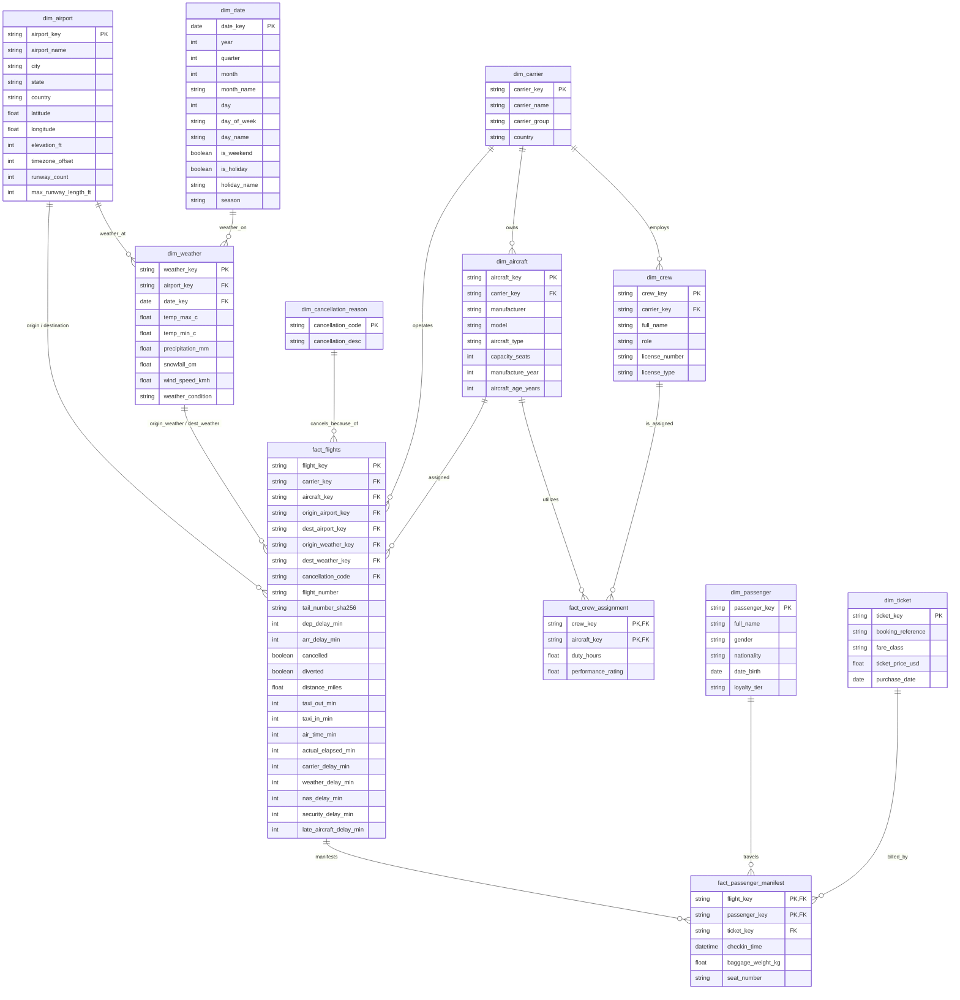

# BẢN VẼ SƠ ĐỒ QUAN HỆ THỰC THỂ (ERD) - DỰ ÁN AEROFLOW

Tài liệu này trình bày bản vẽ và giải thích chi tiết Sơ đồ quan hệ thực thể (ERD) của hệ thống AeroFlow qua hai cấp độ thiết kế:
1.  **Mô hình quan hệ 3NF (Conceptual/Logical Model):** Mô hình hóa thực tế thế giới quan từ file thiết kế `Cap2_ERD.erdplus`.
2.  **Mô hình hình sao DWH (Physical Star Schema):** Mô hình hóa cấu trúc lưu trữ tối ưu trên Google BigQuery để phục vụ Looker Studio.

---

## 1. SƠ ĐỒ MÔ HÌNH HÌNH SAO DWH (GOLD ZONE - BIGQUERY)

Dưới đây là biểu đồ quan hệ các bảng trong Kho dữ liệu (DWH) phục vụ phân tích nghiệp vụ hàng không:

---

## 2. QUAN HỆ VÀ RÀNG BUỘC TOÀN VẸN (FOREIGN KEYS & CARDINALITIES)

### 2.1. Nhánh Khai Thác Bay (Fact Flights Branch)
*   **`dim_airport` $\rightarrow$ `fact_flights` ($1:N$):** Một sân bay có thể xuất hiện trong nhiều chuyến bay với tư cách là sân bay xuất phát (`origin_airport_key`) hoặc sân bay đích (`dest_airport_key`).
*   **`dim_carrier` $\rightarrow$ `fact_flights` ($1:N$):** Mỗi hãng hàng không vận hành nhiều chuyến bay khác nhau.
*   **`dim_aircraft` $\rightarrow$ `fact_flights` ($1:N$):** Mỗi tàu bay cụ thể (nhận diện qua số hiệu đuôi) thực hiện nhiều hành trình bay.
*   **`dim_weather` $\rightarrow$ `fact_flights` ($1:N$):** Thông số thời tiết của ngày bay tại sân bay xuất phát (`origin_weather_key`) và sân bay đến (`dest_weather_key`) được ánh xạ trực tiếp vào bản ghi chuyến bay để đối chiếu liên hệ trễ chuyến do thời tiết.
*   **`dim_cancellation_reason` $\rightarrow$ `fact_flights` ($1:N$):** Mỗi chuyến bay bị hủy được gắn duy nhất một mã lý do hủy thuộc bảng tra cứu.

### 2.2. Nhánh Nhân Sự và Tổ Bay (Crew assignment Branch)
*   **`dim_carrier` $\rightarrow$ `dim_crew` ($1:N$):** Một hãng bay sở hữu và quản lý một danh sách phi hành đoàn riêng.
*   **`dim_crew` $\rightarrow$ `fact_crew_assignment` ($1:N$):** Một phi hành viên có thể nhận nhiệm vụ trên nhiều tàu bay trong năm phân tích.
*   **`dim_aircraft` $\rightarrow$ `fact_crew_assignment` ($1:N$):** Một tàu bay có thể được vận hành luân phiên bởi nhiều tổ bay khác nhau.

### 2.3. Nhánh Hành Khách và Doanh Thu (Passenger Manifest Branch)
*   **`fact_flights` $\rightarrow$ `fact_passenger_manifest` ($1:N$):** Mỗi chuyến bay cụ thể có một danh sách chi tiết (manifest) ghi nhận các hành khách bay cùng chuyến đó.
*   **`dim_passenger` $\rightarrow$ `fact_passenger_manifest` ($1:N$):** Một hành khách có thể bay nhiều chuyến bay khác nhau trong năm.
*   **`dim_ticket` $\rightarrow$ `fact_passenger_manifest` ($1:1$):** Mỗi vé máy bay điện tử được xuất cho duy nhất một hành khách trên một chặng bay cụ thể.
